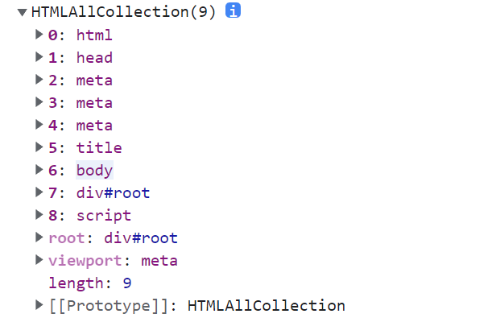

# Falsy

# 定义

- falsy，有时候也称为falsey(英语写法问题)，falsy值是在遇到布尔值上下文时，可以被当成false值处理的非直接false值
- JavaScript在需要使用布尔值上下文的时候，会使用类型转换强迫一个值变为布尔值；典型的布尔值上下文如条件语句和循环语句

# 完整的falsy值表

- 在JavaScript中遇到布尔值上下文会被强迫转换为false的值

| Value(值) | Description（描述） |
| --- | --- |
| false | 布尔值的字面量、关键字false |
| 0 | 数字(Number)零，同样可以用0.0, 0x0等表示 |
| -0 | 数字(Number)负零，同样可以用-0.0, -0x0等表示 |
| 0n | 大整型数（BigInt）零。注意没有大整型数负零 |
| '' "" `` | 空字符串 |
| null | 空（absence）值（没有值） |
| undefined | 缺省（primitive）值 |
| NaN | 不是数字 |
| document.all | 对象是falsy值的唯一情况就是当且仅当对象具有[[IsHTMLDDA]]内部插槽（internal slot）。这个内部插槽只存在于document.all 中，并且在JavaScript不能再被设置 |
- 关于[[IsHTMLDDA]]内部插槽可以查看[ecma262规范](https://tc39.es/ecma262/#sec-IsHTMLDDA-internal-slot)的解释
- `document.all` 在MDN上被说明是一个已被弃用的属性，但是大多数浏览器仍然支持它（向下兼容原则）
- 为什么会存在`document.all`且为什么它在布尔上下文要转换为false可以查看**[stackoverflow](https://stackoverflow.com/questions/10350142/why-is-document-all-falsy/62005426)，**下面是简单解释
    - 为什么存在`document.all` ?
        1. `document.all` 返回一个`HTMLAllCollection` 对象，它按顺序包括从页面根节点开始的所有元素，就像如下所示
            
            
            
        2. 在老版浏览器中，`document.all` 就是用于获取页面元素并设置属性的方法之一，如下
            
            ```jsx
            document.all[0].style.color = "black";
            console.log(document.all[0]);
            console.log(document.all.root);
            ```
            
    - 为什么弃用`document.all` ?
        - 现代的页面的元素都是动态变化的，不可能再用准确的索引获取到指定的元素
        - `document.all` 最多支持通过id获取指定元素的写法而不支持通过类名获取多个元素的写法，已被不能满足前端日益”臃肿“变化的页面
    - 为什么被视为`falsy`值？
        1. 在`document.getElementById` 甚至`document.querySelector` 出现后，越来越多的人选择方便地新的API而不是需要指定索引值`document.all`
        2. 但是在之前仍然有些老版浏览器不支持`document.getElementById` ，所以就出现了下面的写法
            
            ```jsx
            // 侦查
            if (document.all) {
              // 侦察浏览器是否支持all
              document.all[0].style.color = "black";
              console.log(document.all[0]);
              console.log(document.all.root);
            } else {
              // 使用id获取元素
              console.log(document.getElementById("root"));
            }
            ```
            
            - 这种写法在`document.all`和`document.getElmentById` 共存（老页面）时常用
            - 所以在很长一段时间，`document.all` 都是用于检查浏览器是否为老版本，用于兼容老版本浏览器（没有新API）
        3. 现在所有浏览器都支持`getElementById` 这种写法，因为它已被写入规范，且`document.all` 因为难用已被规范抛弃（但是现代浏览器两种写法都支持，因为向后兼容的原则），所以如果`document.all` 是`truthy` ，上述代码永远只使用`document.all` ；一个通过修改代码的解决方案是
            
            ```jsx
            if (document.getElementById) {
              // 侦察浏览器是否支持getElementById 不是老版浏览器
            	// 使用id获取元素
              console.log(document.getElementById("root"));
            } else {
              // 老版本浏览器
            	document.all[0].style.color = "black";
              console.log(document.all[0]);
              console.log(document.all.root);
            }
            ```
            
        4. 遗憾的是，现存的许多古老代码都是使用先判断`document.all` 的方式兼容老版浏览器的，这就导致古老代码**无法**做到老版本使用`document.all` ,现代使用`document.getElementById` （全部使用document.all是不符合逻辑的，这样这个判断语句就没有了意义）；最简单的办法就是让支持`document.getElementById`的浏览器将`document.all` 在布尔上下文中视为`falsy`值，这样就完美解决了兼容问题